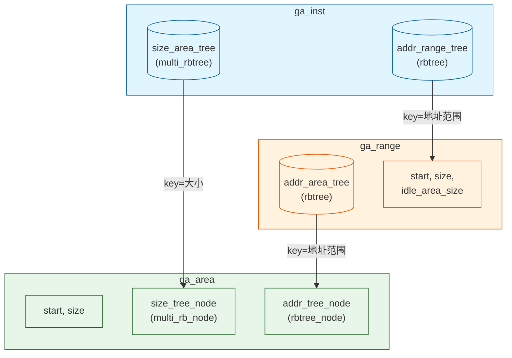

```mermaid
graph TB
    subgraph ga_inst
        ISize[("size_area_tree<br/>(multi_rbtree)")]
        IAddr[("addr_range_tree<br/>(rbtree)")]
    end

    subgraph ga_range
        RAddr[("addr_area_tree<br/>(rbtree)")]
        RAttr["start, size,<br/>idle_area_size"]
    end

    subgraph ga_area
        AAttr["start, size"]
        ASizeNode["size_tree_node<br/>(multi_rb_node)"]
        AAddrNode["addr_tree_node<br/>(rbtree_node)"]
    end

    IAddr -->|key=地址范围| RAttr
    ISize -->|key=大小| ASizeNode
    RAddr -->|key=地址范围| AAddrNode

    classDef inst fill:#e1f5fe,stroke:#01579b
    classDef range fill:#fff3e0,stroke:#e65100
    classDef area fill:#e8f5e9,stroke:#1b5e20
    
    class ga_inst,IAddr,ISize inst
    class ga_range,RAddr,RAttr range
    class ga_area,AAttr,ASizeNode,AAddrNode area
```