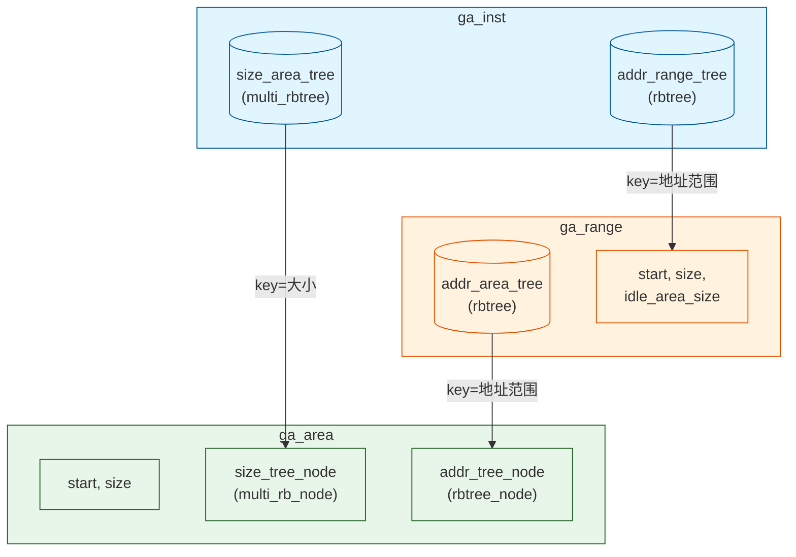

## `gen_allocator.c` 结构化实现与内部原理总结

### 一、整体架构

此文件实现了一个**通用内存分配器 (Generic Allocator, GA)**，用于管理可动态分配/释放的连续内存区域。它基于**两级红黑树**数据结构，实现了 O(log n) 复杂度的内存分配与释放操作。

### 二、核心数据结构

三层数据结构，自底向上：

```
ga_inst (实例)
  ├── addr_range_tree: rbtree  (按地址组织所有 range)
  └── size_area_tree:  multi_rbtree (按大小组织所有空闲 area)
        │
        ├── ga_range (区间)     ← 表示一块连续的大区间（如一段物理内存）
        │    ├── node: rbtree_node (挂入 addr_range_tree)
        │    ├── start, size
        │    ├── idle_area_size  (空闲总量)
        │    └── addr_area_tree: rbtree (按地址组织下属 area)
        │
        └── ga_area (碎片区域)  ← 表示 range 内的一块空闲或已分配的子区域
             ├── size_tree_node: multi_rb_node (挂入 size_area_tree)
             ├── addr_tree_node: rbtree_node (挂入 addr_area_tree)
             ├── start, size
             └── inst, range 指针 (反向引用)
```

**关键特点：**
- `ga_inst` 管理多个 `ga_range`，每个 `ga_range` 管理多个 `ga_area`
- `ga_range` 是"大块"，`ga_area` 是"碎片"
- `addr_range_tree` 和 `addr_area_tree` 按**地址范围**搜索（使用 `rbtree_search_by_range`）
- `size_area_tree` 是 **multi_rbtree**（支持重复 key），按**大小**搜索，用于快速找到大小匹配的空闲区

### 三、核心操作流程

#### 1. 初始化 (`svm_ga_inst_create`)
- 分配 `ga_inst`，初始化读写锁、两个红黑树根节点
- 设置粒度 `gran_size`（所有地址/大小必须对齐到此粒度）

#### 2. 添加区间 (`svm_ga_add_range`)
- 创建一个 `ga_range` + 一个对应整块的 `ga_area`（空闲）
- `ga_range` 插入 `addr_range_tree`
- `ga_area` 同时插入 `addr_area_tree` 和 `size_area_tree`

#### 3. 分配内存 (`svm_ga_alloc`)
分为两种模式：
- **按指定地址分配 (FIXED_ADDR):** 通过 `ga_get_area_by_addr` 找到包含此范围的 area，然后调用 `ga_try_slice_area` 从中切出需要的部分
- **按大小分配 (默认):** 通过 `ga_get_area_by_size` 在 `size_area_tree` 中找 >= size 的最小 area，然后切片

**切片逻辑 (`ga_try_slice_area`)**：
1. 从红黑树中擦除原 area
2. 如果大小刚好相等 → 直接释放 area 节点
3. 如果需要地址片段，在左侧/右侧创建新 area 填补空隙
4. 最终原 area 被释放，左右碎片重新插入树中

```
原始 area: [start, start+size)
分配 [addr, addr+size) 后:
  left_area: [start, addr)         ← 若有空隙
  [已分配]                            ← 这块从树中移除
  right_area: [addr+size, start+size)  ← 若有空隙
```

#### 4. 释放内存 (`svm_ga_free`)
1. 在 `addr_range_tree` 中找到所属的 `ga_range`
2. 在 range 内创建一个新的 `ga_area`（代表被释放的块），插入树中
3. 调用 `ga_try_merge_area` 尝试与相邻的空闲 area **合并**

**合并逻辑 (`ga_try_merge_area`)**：
1. 检查左侧（addr-1）是否有相邻空闲 area → 合并到新的起始地址
2. 检查右侧（addr+size）是否有相邻空闲 area → 合并增大 size
3. 如果有合并，擦除原 area，更新 start/size，重新插入

#### 5. 删除区间 (`svm_ga_del_range`)
- 前提：该 range 必须完全空闲（`ga_is_idle_range` 检查 `idle_area_size == size`）
- 销毁 range 及其下所有 area

#### 6. 回收空闲区间 (`svm_ga_recycle_one_idle_range`)
- 遍历 `addr_range_tree`，找到第一个完全空闲的 range，返回其地址和大小并销毁

### 四、关键设计要点

| 设计 | 说明 |
|------|------|
| **两棵树索引** | `addr_area_tree` 按地址查、`size_area_tree` 按大小查，实现 O(log n) 分配 |
| **multi_rbtree** | 支持多个相同大小的 area 节点，解决红黑树 key 必须唯一的问题 |
| **延迟合并** | 释放时主动合并相邻空闲块，避免外部碎片 |
| **读写锁** | `pthread_rwlock` 保护并发访问，分配用写锁，查询用读锁 |
| **范围搜索** | 通过 `rbtree_search_by_range` 实现区间重叠查询，而非精确匹配 |
| **空闲判定** | 通过 `idle_area_size == range->size` 判断整个 range 是否全空闲 |
| **粒度对齐** | 所有操作都有对齐检查，确保地址/大小是 `gran_size` 的倍数 |

### 五、总结

这是一个**基于两级红黑树的内存碎片管理器**，适用于需要频繁分配/释放不同大小内存块的场景。它通过地址树和大小树双索引加速分配，通过合并策略减少碎片，通过读写锁支持并发访问，结构清晰、接口完整，是一个典型的内存分配器实现。


## `gen_allocator.c` 树形结构组织示意

### 一、整体数据组织结构

```
┌─────────────────────────────────────────────────────────────────┐
│  ga_inst (分配器实例)                                            │
│                                                                  │
│  ┌─ addr_range_tree (红黑树, key=地址范围) ──────────────┐      │
│  │                                                       │      │
│  │  [ga_range A]  start=0x0000, size=0x1000              │      │
│  │   ├─ node              → 挂入 addr_range_tree          │      │
│  │   ├─ idle_area_size    = 当前空闲总量                  │      │
│  │   └─ addr_area_tree (红黑树, key=地址范围) ──────┐    │      │
│  │      ├─ [ga_area A1]  start=0x0000, size=0x0300  │    │      │
│  │      │   ├─ addr_tree_node → 挂入 addr_area_tree  │    │      │
│  │      │   └─ size_tree_node → 挂入 size_area_tree  │    │      │
│  │      ├─ [ga_area A2]  start=0x0500, size=0x0200  │    │      │
│  │      └─ [ga_area A3]  start=0x0800, size=0x0800  │    │      │
│  │                                                   │    │      │
│  │  [ga_range B]  start=0x1000, size=0x2000              │      │
│  │   ├─ idle_area_size    = 0x2000 (全部空闲)            │      │
│  │   └─ addr_area_tree                                  │      │
│  │      └─ [ga_area B1]  start=0x1000, size=0x2000      │      │
│  │                                                       │      │
│  │  [ga_range C]  start=0x3000, size=0x1000              │      │
│  │   └─ ...                                              │      │
│  └───────────────────────────────────────────────────────┘      │
│                                                                  │
│  ┌─ size_area_tree (multi红黑树, key=大小, 含重复key) ───┐      │
│  │                                                        │      │
│  │    size=0x0200 ──→ multi_rb_node ──→ [ga_area A2]      │      │
│  │                                                         │      │
│  │    size=0x0300 ──→ multi_rb_node ──→ [ga_area A1]      │      │
│  │                                                         │      │
│  │    size=0x0800 ──→ multi_rb_node ──→ [ga_area A3]      │      │
│  │                                                         │      │
│  │    size=0x1000 ──→ multi_rb_node ──→ [ga_area C1]      │      │
│  │                                                         │      │
│  │    size=0x2000 ──→ multi_rb_node ──→ [ga_area B1]      │      │
│  └────────────────────────────────────────────────────────┘      │
└─────────────────────────────────────────────────────────────────┘
```

### 二、核心操作的树形变化

#### 2.1 分配内存（by size）— 从 size_area_tree 查找

```
操作: 分配 size=0x0300

Step 1: 查 size_area_tree → 找到 size=0x0300 的 [area A1]
         (精确匹配优先, 否则取 upper_bound)

Step 2: 切片 (ga_try_slice_area)

  分配前地址空间 (range A, addr_area_tree):
  ┌──── A1 (0x0000, 0x0300) ────┬──── 已分配 ────┬──── A2 (0x0500, 0x0200) ────┬──── A3 (0x0800, 0x0800) ────┐
  0x0000                       0x0300           0x0500                        0x0700                       0x1000
  
  假设从 A1 中分配 0x0100 (addr=0x0000):
  
  分配后地址空间:
  ┌─ A1_L (0x0100, 0x0200) ──┬── 已分配 ──┬── A2 (0x0500, 0x0200) ──┬── A3 (0x0800, 0x0800) ──┐
  0x0000                      0x0100       0x0500                    0x0700                     0x1000
  
  树的变化:
  - addr_area_tree: A1 被擦除, A1_L 插入
  - size_area_tree: 删除 size=0x0300 条目, 插入 size=0x0200 条目
```

#### 2.2 分配内存（by fixed addr）— 从 addr_area_tree 查找

```
操作: 在 addr=0x0600 分配 size=0x0100

Step 1: ga_get_range(inst, 0x0600, 0x0100) → 找到 range A
Step 2: ga_range_get_area(range, 0x0600, 0x0100) → 找到 area A2 (0x0500, 0x0200)
Step 3: 切片

  分配前:
  ── A2 (0x0500, 0x0200) ──
  
  分配后:
  ── A2_L (0x0500, 0x0100) ──┬── 已分配 ──┬── A2_R (0x0700, 0x0000, 被丢弃) ──
                              0x0600       0x0700
  
  实际上 A2_R 大小为 0, 不会创建。
```

#### 2.3 释放内存 — 切片 + 合并

```
操作: 释放 addr=0x0100, size=0x0100

Step 1: ga_create_area 创建新 area F (0x0100, 0x0100), 插入树

Step 2: ga_try_merge_area 合并相邻空闲区

  合并前地址空间:
  ┌─ A1_L (0x0000, 0x0100) ──┬── 新F (0x0100, 0x0100) ──┬── A2 (0x0500, 0x0200) ──┐
  0x0000                      0x0100                       0x0200                    0x0400

  Step 2a: 检查左侧 → ga_range_get_area(range, 0x00FF, 1) → 找到 A1_L
           └→ 合并: new_start=0x0000, new_size=0x0100+0x0100=0x0200, 擦除 A1_L
  
  Step 2b: 检查右侧 → ga_range_get_area(range, 0x0200, 1) → 未找到（已分配）
  
  合并后: F.start=0x0000, F.size=0x0200, 重新插入树

  合并后地址空间:
  ┌────────── 合并F (0x0000, 0x0200) ──────────┬── A2 (0x0500, 0x0200) ──┐
  0x0000                                       0x0200                    0x0400
```

### 三、树的关键关系总结



### 四、查找路径总结

| 操作 | 查找路径 | 时间复杂度 |
|------|---------|-----------|
| 按大小分配 | `size_area_tree` → `multi_rb_node` → `ga_area` | O(log n) |
| 按地址分配 | `addr_range_tree` → `ga_range` → `addr_area_tree` → `ga_area` | O(log n) |
| 按地址释放 | `addr_range_tree` → `ga_range` → 创建新 area → 合并相邻 | O(log n) |
| 查找空闲 range | 遍历 `addr_range_tree` → 检查 `idle_area_size == size` | O(n) |