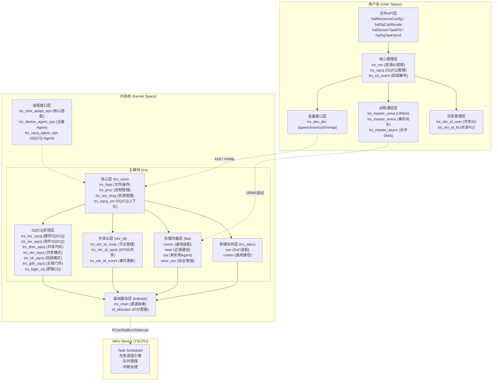
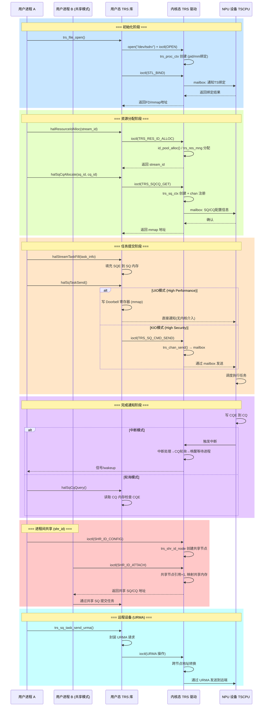
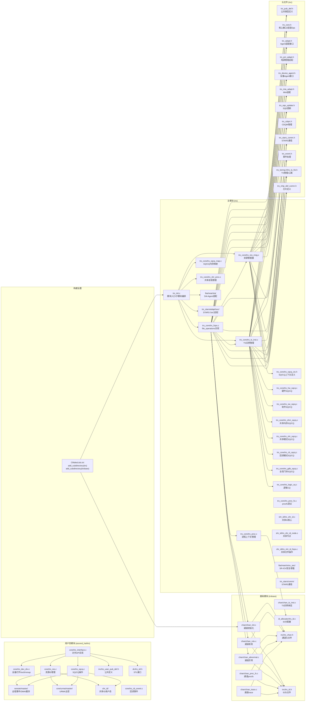
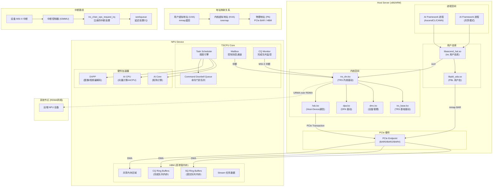
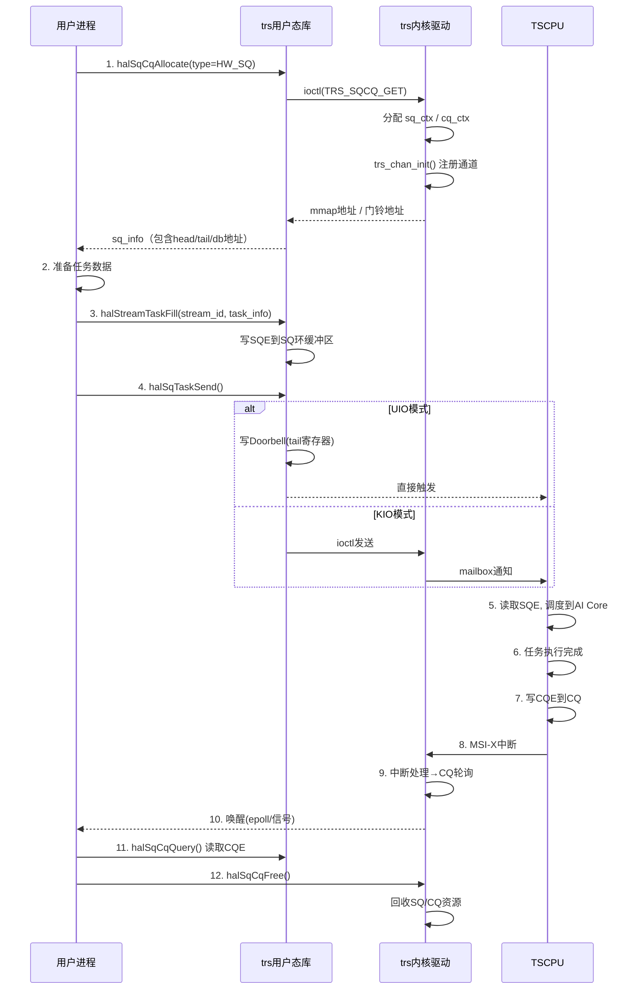
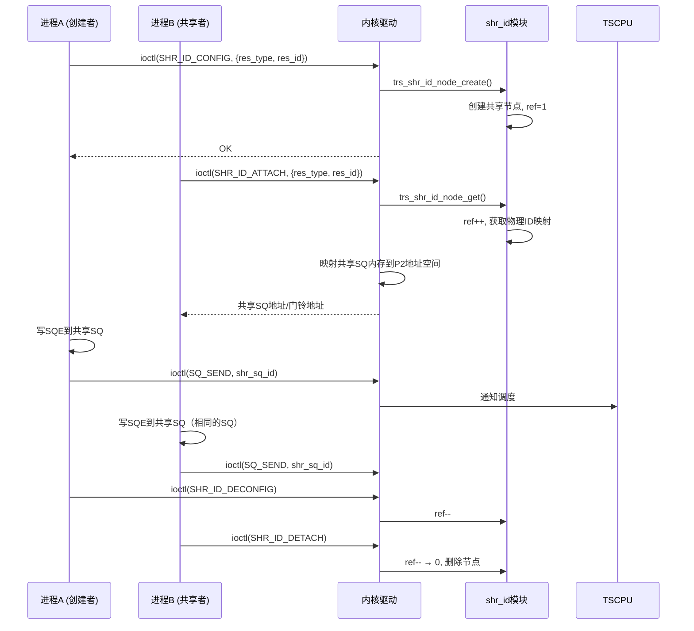
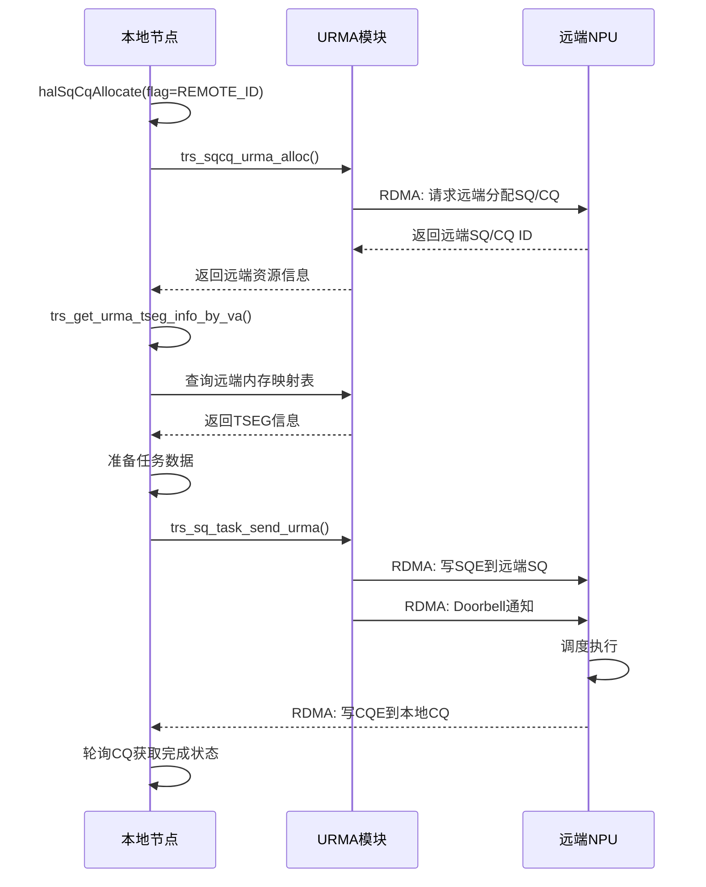
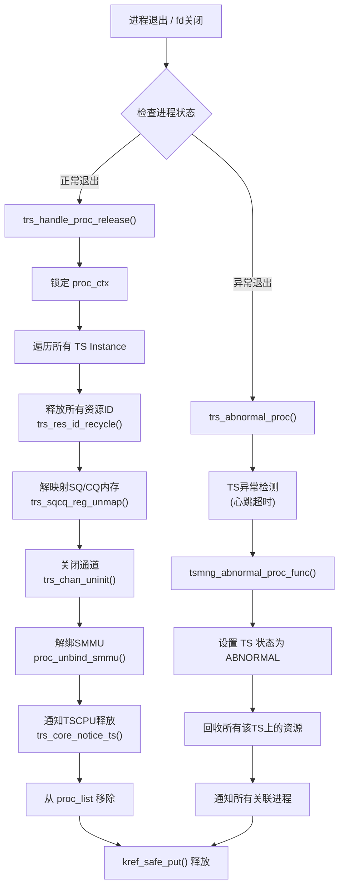

# TRS 模块 4+1 视图设计分析

## 一、逻辑视图 (Logical View) — 模块功能分解与分层

---

## 二、进程视图 (Process View) — 运行时交互与并发

**并发模型要点：**
- 每个用户进程有独立的 `trs_proc_ctx`，通过 `pid` 隔离
- 每个 (devid, tsid) 对对应一个 `trs_core_ts_inst`，持有 SQ/CQ/Stream 上下文
- `trs_sq_ctx` 使用 `ka_mutex_t` 保护 SQ 尾指针并发操作
- 中断处理使用 workqueue 延迟执行，避免在中断上下文中长时间运行
- 进程退出时通过 `trs_proc_ctx` 的 release 回调自动回收资源

---

## 三、开发视图 (Development View) — 源码模块组织与依赖

**依赖方向**：用户态 → 内核字符设备 → trs_core → trsbase → 硬件

---

## 四、物理视图 (Physical View) — 部署与硬件映射

**关键物理映射关系：**

| 资源 | 物理位置 | 映射方式 |
|------|----------|----------|
| SQ 内存 | Host DRAM 或 Device HBM | mmap(BAR) 或 dma_alloc_coherent |
| CQ 内存 | Host DRAM 或 Device HBM | mmap(BAR) 或 dma_alloc_coherent |
| Doorbell 寄存器 | PCIe BAR 空间 | mmap 直接映射到用户态 (UIO) |
| Mailbox | 设备内部寄存器 | 通过 PCIe MMIO 访问 |
| 控制通道 | 设备内部 SRAM/寄存器 | 通过 hdc.ko 驱动访问 |

---

## 五、场景视图 (Scenarios View) — 关键用例

### 场景 1：单进程任务提交与完成（核心流程）

### 场景 2：进程间资源共享 (shr_id)

### 场景 3：远程设备任务调度 (URMA)

### 场景 4：异常处理与进程退出

---

## 六、4+1 视图总结矩阵

| 视图 | 核心关注点 | TRS 模块对应 |
|------|-----------|-------------|
| **逻辑视图** | 系统功能分解、模块职责、接口 | 用户态 API 层 → 内核核心层 → 通道/ID池 → 设备 Agent，层次分明 |
| **进程视图** | 运行时交互、并发、同步、通信 | 独立进程 ctx、mutex/spinlock 保护、UIO/KIO 双模式、中断/workqueue 异步 |
| **开发视图** | 源码组织、模块依赖、构建关系 | `trs` + `trsbase` 双模块、`inc/` 统一头文件、`lba/shr_id/stars` 子目录解耦 |
| **物理视图** | 硬件部署、地址映射、中断路径 | Host DRAM/Device HBM 双端内存、PCIe BAR mmap、MSI-X 中断、URMA RDMA 跨节点 |
| **场景视图** | 关键用例：任务提交、资源共享、远程调度、异常恢复 | 覆盖正常任务生命周期 + 多进程协作 + 跨节点扩展 + 容错恢复 |

Completed: *绘制4+1视图* (2/2)

以上通过 **4+1 视图模型** 完整展示了 TRS 模块的设计：

1. **逻辑视图** — 分层功能分解：用户态 API → 内核核心 → SQ/CQ实现 → 通道/ID池 → 设备端
2. **进程视图** — 运行时并发交互：进程隔离、UIO/KIO 双模式、中断/workqueue 异步、共享/远程场景时序
3. **开发视图** — 源码组织结构与依赖关系：`trs` + `trsbase` 双模块、清晰的头文件/实现分离
4. **物理视图** — 部署与硬件映射：Host/Device 内存模型、PCIe BAR mmap、中断路径、RDMA 跨节点
5. **场景视图** — 关键用例：任务提交完成、进程间共享、远程调度、异常恢复